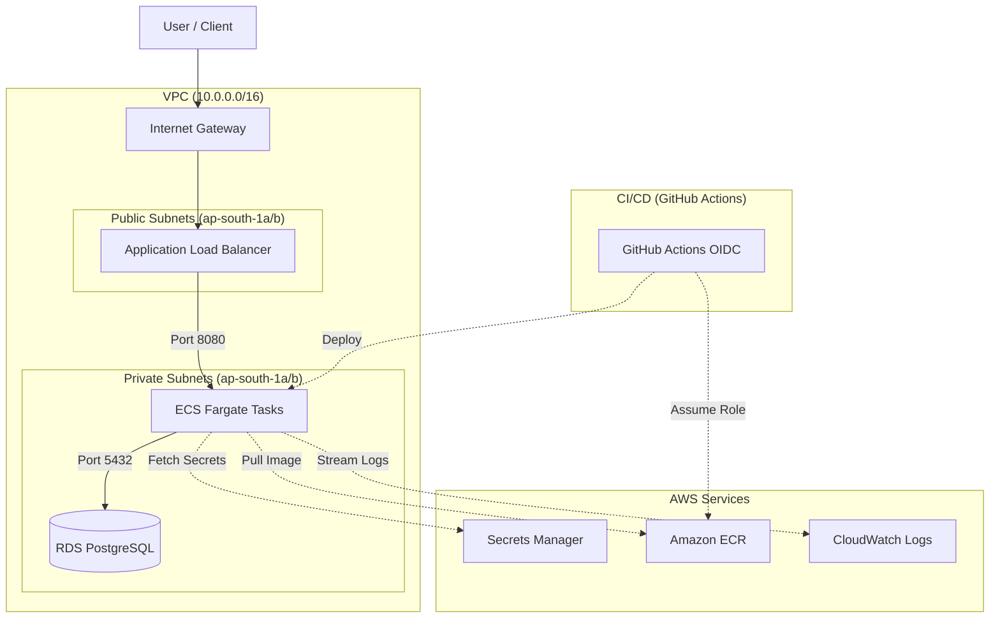

# BudgetX AWS Infrastructure Setup Guide

> **Author:** Winston (System Architect)
> **Target:** Itachi & Engineering Team

This document outlines the practical, scalable foundation for the BudgetX application on AWS. Based on our current Terraform configuration (`infra/main.tf`), we've chosen a lean, highly reliable stack that prioritizes automation, security, and developer productivity over needless complexity. Let's walk through what exists and how to set it up.

## Architecture Overview



## 1. Network Topology (VPC)

We start with a standard public/private VPC pattern. It’s boring, and in networking, boring is exactly what we want.

- **VPC:** `10.0.0.0/16`
- **Public Subnets:** Two subnets (across two Availability Zones `ap-south-1a`, `ap-south-1b`) paired with an Internet Gateway to host our Application Load Balancer (ALB).
- **Private Subnets:** Two subnets to securely host our RDS database, isolated from the public internet.

## 2. Compute: ECS with Fargate

For the compute layer, we bypass the overhead of managing EC2 instances or Kubernetes and use **Amazon Elastic Container Service (ECS) with Fargate**.

- **Cluster:** `budgetx-cluster` with Container Insights enabled for robust observability.
- **Service:** The `budgetx-data-service` runs containerized on port `8080`.
- **Registry:** Amazon Elastic Container Registry (ECR) securely stores our Docker images with mutable image tags and KMS encryption enabled.

> [!TIP]
> **Container Insights** natively streams metrics to CloudWatch, saving us the overhead of managing third-party monitoring agents for basic health metrics.

## 3. Database: RDS PostgreSQL

We rely on PostgreSQL 15.4 for our relational data. It's the industry standard for stable, transactional workloads.

- **Instance:** `db.t4g.micro` with `20GB` allocated storage (cost-effective and efficient for early growth).
- **Security:** Placed strictly inside our **Private Subnet**; it is entirely blocked from public access.
- **Credentials:** We use `manage_master_user_password = true`, which natively integrates with AWS Secrets Manager, eliminating manual password handling.
- **Backups:** 7-day retention period for automated snapshots.

## 4. Application Load Balancer (ALB)

The ALB is the front door to our service.

- **Placement:** Public Subnets.
- **Routing:** A target group pointing to the ECS Fargate tasks via IP on port `8080`.
- **Health Checks:** Expects a `200 OK` from `/api/health`.
- **Security:** Incoming traffic on port `80` automatically redirects (`HTTP 301`) to port `443` (HTTPS) to guarantee encrypted transit. 

> [!IMPORTANT]
> The HTTPS listener requires an SSL certificate (provisioned via ACM usually). Ensure DNS validation is complete for the certificate before pointing your domain to the ALB.

## 5. Secrets Management

Hardcoded secrets in the environment are a liability.

- **AWS Secrets Manager:** We've provisioned `budgetx-production-secrets`.
- Your ECS tasks will reference this via IAM roles to securely fetch runtime environment variables like `DATABASE_URL`, `ENCRYPTION_KEY`, and `JWT_SECRET`.

## 6. CI/CD Integration: GitHub OIDC

We don’t use static IAM credentials for GitHub Actions. Long-lived credentials are an unnecessary attack vector.

- **Pattern:** OpenID Connect (OIDC).
- **Implementation:** GitHub Actions assumes a dedicated IAM Role (`budgetx-github-actions-role`) bounded exclusively to the `Shashwat-Joshi/BudgetX` repository.
- **Permissions:** Restricted to ECR interactions (for pushing images) and ECS updates (for triggering deployments).

---

## Deployment Playbook

To apply this architecture:

1. **Prerequisites:** Ensure your AWS CLI is authenticated and Terraform `v1.5.0+` is installed.
2. **Initialize:** 
   ```bash
   cd infra
   terraform init
   ```
3. **Plan:**
   ```bash
   terraform plan -out=tfplan
   ```
   *Review the output carefully. Infrastructure as Code is unforgiving.*
4. **Apply:**
   ```bash
   terraform apply tfplan
   ```
5. **Post-Apply Steps:**
   - Add your necessary application secrets to `budgetx-production-secrets` in Secrets Manager.
   - Configure your Git repository to map to the specified GitHub Actions IAM Role via OIDC for deployment.

> **Winston's Note:** This architecture leverages minimal moving parts while offering horizontal scalability for the application layer. Keep it simple, and it will scale.
