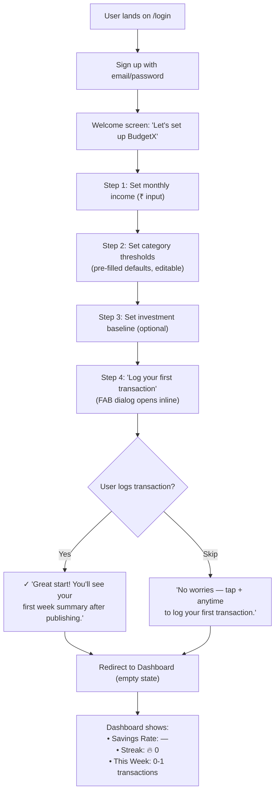
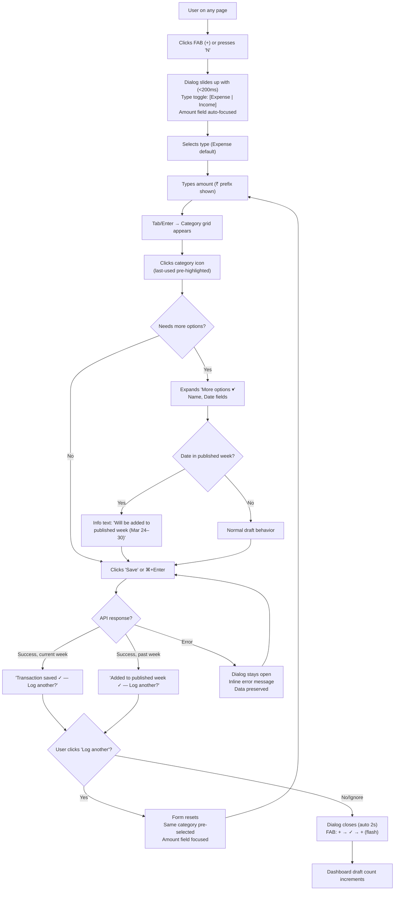
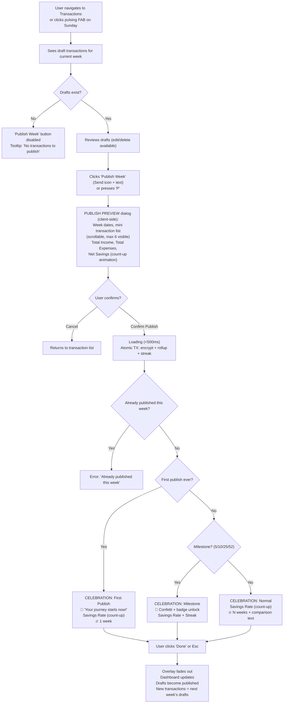
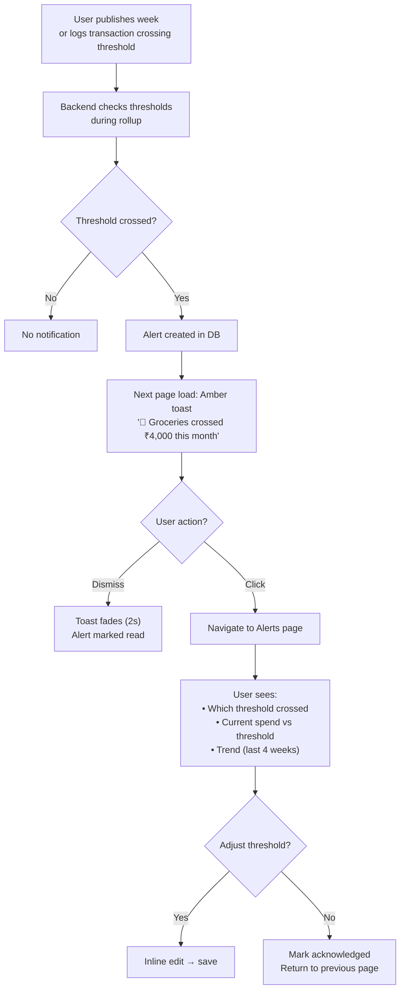
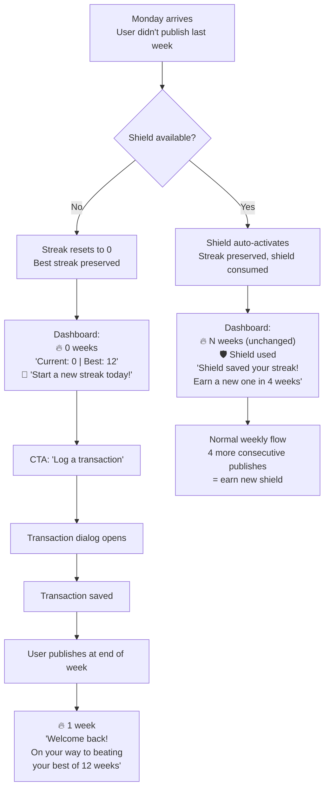
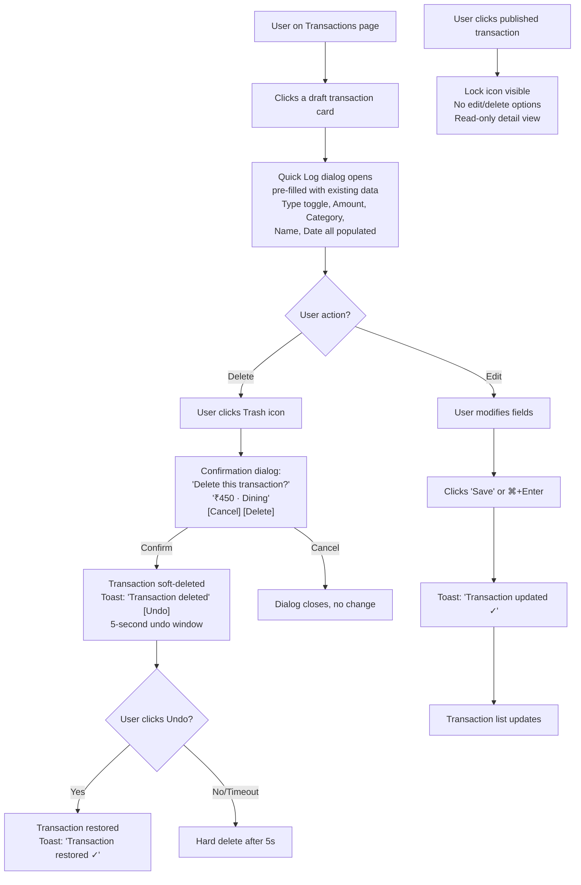

# UX Design Specification — BudgetX

**Author:** Itachi
**Date:** 2026-04-06

---

## Executive Summary

### Project Vision

BudgetX transforms personal finance tracking from passive record-keeping into an active weekly discipline through a publish-ritual UX pattern. Users log transactions as drafts throughout the week, then "publish" them in a deliberate weekly act that triggers gamification feedback (streaks, badges, savings rate). The experience targets 2-3 trusted friends in India using desktop web browsers, with a focus on habit formation through behavioral psychology rather than feature depth.

### Target Users

- **Primary persona:** Young Indian professional (25-35), tech-savvy, salaried
- **Usage context:** Desktop Chrome, weekly evening sessions for publish ritual, quick daily logging throughout the week
- **Motivation:** Wants financial awareness without the tedium of traditional budgeting
- **Pain points with alternatives:** Existing apps are either too complex (Excel), too passive (auto-categorizing bank apps), or don't create accountability habits
- **Success metric:** User publishes every week and maintains streak

### Key Design Challenges

1. **Quick-log friction elimination** — FAB → dialog overlay → save must be fastest possible flow (<3 interactions to log a transaction). Category selection uses icon grid sorted by frequency + last-used pre-selection.
2. **Publish ritual significance** — single most important UX moment; must feel ceremonial with a **full-screen celebration overlay** showing savings rate, streak increment animation, badge unlocks, and weekly comparison.
3. **Dashboard information density** — lifetime totals, month breakdown, savings rate, streaks, badges, FAB on one screen without overwhelm. Server-rendered via RSC = real data on first paint, not loading skeletons.
4. **Desktop-first responsive design** — leverage horizontal space (sidebar, multi-column) for `lg` primary, graceful collapse to icons-only sidebar on `md`.
5. **Transaction state visual language** — three edit states require distinct UX:
   - **Draft:** Fully editable, muted/desaturated card with dotted border
   - **Published (grace period):** Editable with confirmation warning, solid card, full saturation
   - **Published (locked):** Read-only, lock icon, tooltip explanation
6. **Temporal context** — visual week separators in transaction list ('Week of Mar 31 - Apr 6') so the draft/published split doesn't feel arbitrary.
7. **Empty state design** — every empty state is an onboarding hook, not a 'No data' dead end. Animated arrows pointing to actionable elements.

### Design Opportunities

1. **Gamification as emotional design** — streak animations, badge unlocks, and savings rate reveals as the behavioral payoff. The post-publish celebration screen should be screenshot-worthy.
2. **Post-publish celebration moment** — dedicated full-screen overlay with weekly summary, trend comparisons, streak fire animation. Creates rewarding feedback loop. Prep for Phase 2 'Share with friends.'
3. **Progressive disclosure** — simple dashboard → deep analytics drill-down, never overwhelming the main view.
4. **Alert threshold encouragement** — persistent but dismissible banner on dashboard if user hasn't set up thresholds: 'Set up spending alerts to get notified when you overspend.'

### Design Principles

**Tone of Voice:**
- **Tone:** Encouraging, slightly playful, never preachy
- **Voice:** Like a supportive friend who's good with money
- **Microcopy examples:**
  - Empty streak: 'Start your streak! Log a transaction today.' (not 'No streak data available.')
  - Publish success: 'Week locked in! 🔥 4-week streak!' (not 'Transactions published successfully.')
  - Alert triggered: 'Heads up — you've crossed ₹4,000 on groceries this month.' (not 'Alert: Grocery threshold exceeded.')
  - Error: 'Something went wrong. Your data is safe — try again.' (not 'Error 500: Internal Server Error')

**Accessibility (WCAG 2.1 AA):**
- Color is never the only indicator — always pair with icons, text, or patterns (e.g., ↓/↑ arrows for expenses/income, not just red/green)
- Keyboard navigation for all interactive elements (tab order, focus rings)
- Screen reader support for key flows (login, transaction form, publish)
- Gamification elements (streak numbers, badge icons) must be screen-reader accessible, not decorative

**Navigation Architecture:**
```
📊 Dashboard        (home/default)
📝 Transactions     (draft list + history)
📈 Analytics        (trends, breakdowns)
🔔 Alerts           (config + history)
👥 Friends          (list + add)
⚙️ Settings         (account, password)
```
Six sidebar items with icons + labels. Active state highlighted. Collapse to icons-only on `md` breakpoint.

**Key UX Decisions:**
- FAB opens a **dialog overlay** (shadcn `Dialog`), not page navigation — feels instant, stays on current page
- Dashboard is **server-rendered with real data** on first paint (RSC), not loading skeletons on initial load
- Category selection uses **icon-based grid** sorted by user frequency, with last-used pre-selected

---

## Core User Experience

### Defining Experience

BudgetX has a **dual-loop core experience** — two distinct interactions that form a single habit cycle:

**Loop 1: Quick Log (Daily, ~30 seconds)**
The user sees the FAB → clicks it → dialog opens instantly → types amount → taps a category icon → hits save → dialog closes → done. This happens multiple times per day and must feel *effortless*. Target: **under 10 seconds from intent to saved transaction.**

**Loop 2: Publish Ritual (Weekly, ~2 minutes)**
The user opens the Transactions page → reviews the week's drafts → clicks "Publish Week" → **publish preview dialog** shows transaction count, total spend, total income, net savings (the 'drumroll') → clicks 'Confirm Publish' → **full-screen celebration overlay** reveals savings rate, streak increment, badge progress → user absorbs their financial picture → closes overlay → dashboard reflects new data. Target: **an emotional payoff that makes the user look forward to next week.**

The dual-loop creates a **daily micro-habit** (logging) that feeds a **weekly macro-habit** (publish ritual). Neither works without the other.

**Dashboard as Daily Trigger:**
Since there are no push notifications (desktop web), the dashboard itself serves as the check-in trigger. On every visit it shows: **'This week: X transactions logged'** — a running draft count (count only, not amounts, due to encryption). This gives users a reason to open BudgetX even when they don't have a transaction to log.

### Platform Strategy

| Dimension | Decision | Rationale |
|-----------|----------|----------|
| Platform | Web application (Next.js) | Desktop-first, no app store friction |
| Input method | Mouse + keyboard (primary) | Desktop usage context |
| Primary viewport | `lg` (1024px+) | Multi-column layouts, sidebar navigation |
| Minimum viewport | `md` (768px+) | Collapsed sidebar, single-column fallback |
| Below minimum | Mobile-gate message | MVP1 scope control, no mobile layout |
| Offline | Not supported | Always-connected desktop usage assumed |
| Browser | Chrome (latest 2 versions) | Target user's browser of choice |

**Keyboard Shortcuts (Power Users):**

| Shortcut | Action |
|----------|--------|
| `N` | New transaction (opens FAB dialog) |
| `P` | Publish week (when drafts exist) |
| `1`–`6` | Navigate sidebar items |
| `Esc` | Close any dialog/overlay |
| `⌘+Enter` / `Ctrl+Enter` | Save/submit current form |

Subtle `⌘K` hint in the UI opens a command palette listing all shortcuts.

### Effortless Interactions

**Must be zero-friction:**

| Interaction | Target | How |
|-------------|--------|-----|
| Log a transaction | <10 seconds | FAB → dialog → icon grid category → save |
| See financial overview | Instant on load | Server-rendered dashboard with real data (RSC) |
| Check streak status | Always visible | Streak counter in dashboard header |
| Category selection | 1 tap, no scrolling | Icon grid sorted by frequency, last-used pre-selected |
| Publish week | 3 clicks (button → preview → confirm) | "Publish Week" → preview dialog → confirm → celebration |
| Dashboard drill-down | Click any category | Category card → filtered transaction list |

**Should feel automatic:**

| Interaction | Automatic Behavior |
|-------------|-------------------|
| Alert checking | Synchronous polling after each transaction save |
| Rollup calculations | Triggered by publish — no user action needed |
| Badge awards | Checked on publish — user surprised with celebration |
| Draft accumulation | Transactions auto-save as DRAFT |
| Category list loading | Pre-loaded in Zustand on login |

**FAB State Awareness:**
The FAB adapts to the user's weekly cycle:
- **Default:** '+' icon, primary color — ready to add
- **Publish day (Sunday):** Subtle pulse animation + 'Publish!' badge overlay — becomes the publish CTA
- **Post-publish (same session):** Checkmark briefly → returns to '+'

### Critical Success Moments

**Moment 1: First Transaction Logged (Day 1)**
The user's first interaction with the FAB. If the dialog opens fast, the form is simple, and the save feels instant — they'll come back. **The onboarding flow ends by pre-opening the FAB dialog**, guaranteeing the user logs their first transaction *within* onboarding, not after. Then redirect to dashboard: 'This week: 1 transaction logged — you're on your way!'

**Moment 2: First Publish (End of Week 1)**
First time clicking "Publish Week." The preview dialog shows numbers, the celebration overlay reveals savings rate, streak reaches 1. The user realizes this isn't just expense tracking — it's a game they want to keep playing.

**Moment 3: Breaking a Streak**
The most dangerous retention moment. Handle with encouragement, not shame:
- Show **both** numbers: **'Current: 0 weeks | Best: 7 weeks'**
- The 'best' number becomes a target to beat, not a loss to mourn
- CTA: 'Start a new streak today!' with animated FAB pointing

**Moment 4: First Alert Trigger**
When spending exceeds a threshold, the toast uses **amber/yellow** tones (never red):
- Shows progress, not failure: 'Groceries: ₹4,200 of ₹4,000 budget'
- A progress indicator that happens to be over 100%
- Alert history page shows the pattern over time, not individual violations

### Experience Principles

1. **Speed Over Features.** A fast, simple interaction beats a powerful, slow one. Every user-facing action must feel instant (<200ms perceived latency). If we choose between adding a feature and making an existing flow faster, choose speed.

2. **Ritual Over Routine.** The weekly publish isn't a task — it's a ritual. Design it with the significance of a ceremony: anticipation (preview dialog) → action (confirm publish) → reward (celebration overlay) → reflection (updated dashboard). Every visual element reinforces that this moment matters.

3. **Encouragement Over Surveillance.** BudgetX doesn't judge. Alerts use amber tones, never red. No 'over budget' warnings — only progress indicators. The user should feel *empowered*, not *watched*.

4. **Data at a Glance, Detail on Demand.** Explicit hierarchy:
   - **Glance (Dashboard):** Savings rate (%), streak counter, weekly draft count, category donut (top 5), income vs. expenses (2 numbers)
   - **Demand (Analytics):** Month-over-month trends, category breakdown with transactions, savings rate trend over time, YTD totals, investment vs. expense ratio
   - Dashboard items are *never* mixed into analytics; analytics items *never* clutter the dashboard.

5. **Failure is Recovery, Not Punishment.** Broken streaks, missed weeks, threshold breaches — all presented as recovery opportunities with clear CTAs. Always show the path forward.

---

## Desired Emotional Response

### Primary Emotional Goals

| Emotion | Trigger Moment | Why It Matters |
|---------|---------------|----------------|
| **Empowered** | Dashboard view (savings rate, streaks visible) | User feels in control of their finances — not overwhelmed, not ignorant, *in control* |
| **Accomplished** | Post-publish celebration overlay | The weekly payoff — the user actively *did something* about their finances |
| **Curious** | Analytics drill-down, trend charts | "Hmm, I spent more on dining out this month" — discovery without judgment |
| **Anticipation** | Publish preview dialog (the 'drumroll') | The moment before the reveal — will my savings rate go up? Did I earn a badge? |

### Emotional Journey Mapping

```
First Visit (Onboarding)
  😊 Welcome + ease → "This is simple, I can do this"
  → Config thresholds + investment baseline
  → First transaction logged within onboarding
  😌 Relief → "That was painless"

Daily Loop (Quick Log)
  😐 Neutral intent → "I need to log this coffee"
  → FAB click → instant dialog → save
  😊 Micro-satisfaction → "Done. 3 seconds."
  → Dashboard shows updated draft count
  🙂 Ambient awareness → "5 transactions this week"

Weekly Ritual (Publish)
  🤔 Curiosity → "Let me review my week"
  → Scroll through drafts
  😬 Anticipation → "Let's see the numbers"
  → Click Publish → Preview dialog shows totals
  🥁 Drumroll → "Here we go..."
  → Confirm → Celebration overlay
  🎉 Accomplishment → "4-week streak! 38% savings rate!"
  → Close overlay → Dashboard updated
  😌 Satisfaction → "I'm on track"

Alert Trigger
  🔔 Gentle awareness → "Heads up — groceries crossed ₹4,000"
  🤔 Reflection → "I'll keep an eye on that"
  (NOT 😰 anxiety, NOT 😤 guilt)

Streak Break
  😟 Brief disappointment → "I missed last week"
  → See "Current: 0 | Best: 7"
  💪 Motivation → "I want to beat my record"
  → CTA: "Start a new streak today!"
  😊 Recovery → "Logged a transaction, I'm back"
```

### Micro-Emotions

**Confidence vs. Confusion:**
Users must always know *where they are* and *what to do next*. The sidebar shows current page (active state). Every empty state has a CTA. Form validation is inline, immediate, and specific ('Amount must be greater than 0' — not 'Invalid input').

**Trust vs. Skepticism:**
Financial data is sensitive. Trust is built through:
- Encryption badge visible in settings ('Your data is encrypted with AES-256')
- No third-party data sharing — stated clearly in onboarding
- Transaction amounts never appear in URLs, logs, or page titles
- Consistent, bug-free behavior — trust is lost on the first glitch

**Accomplishment vs. Frustration:**
The publish celebration is the accomplishment engine. Frustration prevented by:
- Never blocking the user from progressing (no forced tutorials, no mandatory fields beyond amount + category)
- Optimistic UI for transaction saves (show saved state immediately, rollback on error)
- Error recovery is always one CTA away

**Delight vs. Satisfaction:**
- Streak milestones (5, 10, 25, 52 weeks) trigger **extra** celebration (special badge, confetti animation) — this is *delight*
- Normal publishes trigger the standard celebration — this is *satisfaction*
- Delight is reserved for moments of surprise; overusing it dilutes the impact

### Design Implications

| Emotional Goal | UX Implementation |
|---------------|-------------------|
| **Empowered** | Savings rate prominently on dashboard, large font, positive color gradient (low→high = cool→warm). User always knows their number. |
| **Accomplished** | Celebration overlay with streak animation (fire emoji scales up), confetti on milestones, badge unlock with subtle sound cue option. |
| **Curious** | Analytics charts use hover tooltips. Category cards on dashboard are clickable for drill-down. Comparison text uses neutral language ('12% more than last month' — no 'worse'/'better'). |
| **Anticipation** | Publish preview dialog shows numbers with brief count-up animation (0 → actual) for total spend and savings rate. 'Confirm Publish' button pulses gently. |
| **Trust** | HTTPS everywhere, encryption metadata in settings, no external tracking scripts, minimal permissions, consistent UI (no layout shifts). |
| **Recovery** | Streak break shows "Best: N" as motivation target. Error states have single-action recovery CTAs. Lost connection shows "reconnecting..." with auto-retry. |

### Emotional Design Principles

1. **Celebrate consistency, not perfection.** A 25% savings rate with a 10-week streak is worth celebrating more than a 50% savings rate in week 1. The streak matters more than the number.

2. **Surprise sparingly.** Confetti and special animations only for streak milestones (5/10/25/52). Normal publishes get the standard celebration. If everything is special, nothing is special.

3. **Anxiety is the enemy.** Financial apps naturally induce anxiety. Every design choice should reduce it: amber not red, progress not failure, trends not judgments, recovery not punishment.

4. **Micro-satisfactions compound.** The 3-second transaction save, the FAB checkmark flash, the daily draft count update — each one is tiny, but together they create a feeling of "this works for me."

5. **Silence is golden.** Don't celebrate or notify when there's nothing meaningful happening. No "You haven't logged a transaction today!" reminders. The dashboard's draft count speaks silently.

---

## UX Pattern Analysis & Inspiration

### Inspiring Products Analysis

**1. Splitwise — Effortless Expense Logging**

| What They Nail | BudgetX Lesson |
|---------------|----------------|
| Add expense in 3 taps — amount, description, done | FAB → dialog: amount + category = done. Description optional. |
| Clean, distraction-free input form with large amount display | Transaction form foregrounds amount input — big, focused, auto-keyboard-focus on open |
| Activity feed as primary view — recent first | Transaction list: drafts at top (newest first), published below, grouped by week |
| Green/red for settled/unsettled — instant visual status | Draft (muted/dotted) vs. published (solid/saturated) visual language |

**2. CRED — Premium Financial UI & Reward Psychology**

| What They Nail | BudgetX Lesson |
|---------------|----------------|
| Dark theme with rich gradients — feels premium, trustworthy | Consider dark-mode-first palette for financial sophistication |
| Number count-up animations on reveal | Savings rate + streak counter animate on dashboard load and post-publish |
| Reward reveals with satisfying animation | Badge unlock + streak increment follows reveal pattern: anticipation → payoff |
| Card-based layout with generous whitespace | Dashboard uses shadcn `Card` with consistent padding and elevation |
| Minimal navigation (4-5 items) | 6-item sidebar matches CRED's restraint |

**3. Groww — Data Visualization for Finance**

| What They Nail | BudgetX Lesson |
|---------------|----------------|
| Portfolio summary at a glance — one screen | Dashboard mirrors: income, expenses, savings rate, category allocation without scrolling |
| Clean charts with hover details | Recharts: donut for categories, area chart for trends, tooltips on hover |
| Green/red with ↑/↓ arrows — never color alone | WCAG compliance: expense ↓ + cool tones, income ↑ + warm tones |
| "vs. last month" comparison periods | Analytics shows month-over-month with neutral phrasing |

**4. Duolingo — Streak Psychology & Habit Formation**

| What They Nail | BudgetX Lesson |
|---------------|----------------|
| Streak as THE retention mechanic | Streak counter: dashboard header, always visible, fire icon |
| Streak freeze — miss a day, keep streak with a freeze | **Streak shield** (see below) — earned after 4 consecutive publishes |
| XP celebrations after lesson | Publish → celebration overlay → savings rate reveal follows same arc |
| Encouraging recovery — gentle, not pushy | "Start a new streak today!" — same encouraging tone |
| Progressive difficulty | Onboarding starts with logging; thresholds, analytics, badges discovered progressively |

### Streak Shield (Inspired by Duolingo Freeze)

**Earned, not given:**
- After **4 consecutive weekly publishes**, user earns a streak shield
- Shield auto-activates if user misses one publish week — streak survives
- Shield is consumed on use (need another 4 consecutive weeks to earn next)
- **Visual:** Shield icon next to streak counter when active
- A user with a 12-week streak who misses one week keeps it — much better retention than hard reset

**Architectural note:** Add to existing `streaks` table: `shield_available (BOOLEAN)`, `shield_earned_at (TIMESTAMP)`, `shield_used_at (TIMESTAMP)`. Checked within the existing `PublishService` atomic transaction.

### Dashboard Reveal Animation (Inspired by CRED)

On **first visit per session only** (not on every navigation back to dashboard):

1. Savings rate card: number count-up (0% → 38%) over 600ms
2. Streak counter: fire icon scales up + number appears
3. Category donut: segments animate in clockwise
4. Income vs. Expense: bars grow from zero

**Progressive enhancement:** Server-renders actual data in HTML (RSC). Client-side JS triggers animation on hydration. If JavaScript fails, user sees static numbers. Animation never blocks data display.

```typescript
// Client component wraps the server-rendered number
<AnimatedNumber value={savingsRate} duration={600} suffix="%" />
```

Repeat visits within the same session show static numbers instantly.

### Transaction List Ordering

- **Drafts (this week)** — always at the top, reverse chronological
- **Visual separator line** — "Published Transactions" divider
- **Published (previous weeks)** — below drafts, grouped by week header ("Week of Mar 31 – Apr 6"), reverse chronological

### Transferable UX Patterns

**Navigation Patterns:**
- Splitwise's activity feed as home → dashboard as daily trigger with draft count
- CRED's minimal nav items → 6 sidebar items, no more
- Groww's portfolio summary first → dashboard shows glance data, analytics shows depth

**Interaction Patterns:**
- Splitwise's 3-tap expense add → FAB → amount → category → save
- CRED's number count-up animation → savings rate, streak animate on reveal
- Duolingo's celebration after action → publish → preview → celebration overlay
- Groww's hover tooltips on charts → Recharts tooltips for category/trend detail

**Visual Patterns:**
- CRED's dark theme + gradients → dark-mode-first palette with warm accent gradients
- CRED's card-based layout → shadcn `Card` for all dashboard summary blocks
- Groww's ↑/↓ arrows alongside color → WCAG compliance for income/expense
- Splitwise's visual status → draft vs. published card styles

**Gamification Patterns:**
- Duolingo's streak as primary metric → streak counter always visible
- Duolingo's tiered celebrations → normal publish = standard, milestones = confetti
- Duolingo's streak freeze → earned streak shield (4 consecutive publishes)
- Duolingo's encouraging recovery → "Start new streak!" not "You failed"

### Anti-Patterns to Avoid

| Anti-Pattern | Source | Why Avoid |
|-------------|--------|----------|
| Aggressive push notifications | Duolingo | BudgetX principle: "Silence is golden" |
| Luck-based gamification (spin wheels) | CRED | BudgetX rewards *consistency*, not *chance* |
| Group/social complexity | Splitwise | Personal-first; friends are observational only |
| Mobile-first information cramming | Groww | Desktop real estate — use it with whitespace |
| Forced onboarding tutorials | Multiple | Empty states as onboarding hooks instead |
| Over-detailed input forms | Banking apps | Amount + category = sufficient |

### Design Inspiration Strategy

**Adopt Directly:**
- Duolingo's streak psychology (counter, tiered celebrations, encouraging recovery, streak shield)
- CRED's count-up number animations (savings rate, streak counter reveals)
- Splitwise's minimal input form (amount → category → done)
- Groww's chart tooltip pattern (Recharts hover for details)

**Adapt for BudgetX:**
- CRED's dark premium aesthetic → BudgetX-specific dark palette
- Groww's portfolio summary → BudgetX dashboard with savings rate instead of NAV
- Duolingo's XP celebration → publish celebration with savings rate instead of XP
- CRED's reveal transitions → dashboard reveal animation (first session visit only)

**Explicitly Avoid:**
- Push notification harassment
- Scratch-card / luck gamification
- Social complexity
- Mandatory onboarding tutorials

---

## Design System Foundation

### Design System Choice

**shadcn/ui + Tailwind CSS** (decided in architecture)

| Decision | Value |
|----------|-------|
| Component library | shadcn/ui (copy-paste, not dependency) |
| CSS framework | Tailwind CSS (utility-first) |
| Theme approach | CSS variables via shadcn theme system |
| Icons | Lucide React (bundled with shadcn/ui) |
| Charts | Recharts |
| Mode | **Dark mode primary**, light mode secondary |

### Rationale for Selection

1. **shadcn/ui is copy-paste, not a dependency.** Components live in `components/ui/`. You own them. No version lock-in, no breaking updates.
2. **Tailwind CSS + shadcn/ui = CRED-level aesthetics out of the box.** Dark mode, clean typography, beautiful form elements — all without custom CSS.
3. **Built-in accessibility.** Radix UI primitives under the hood — WCAG 2.1 AA compliant by default (keyboard navigation, ARIA attributes, focus management).
4. **Already in architecture.** No additional integration decisions needed.

### Color Palette (Dark Mode Primary)

| Token | Role | Value (HSL) | Visual |
|-------|------|------------|--------|
| `--background` | Page background | `222 47% 6%` | Near-black with blue undertone |
| `--card` | Card surfaces | `222 47% 9%` | Slightly elevated from background |
| `--primary` | Primary actions, FAB | `142 70% 45%` | Emerald green (financial growth) |
| `--primary-foreground` | Text on primary | `0 0% 100%` | White |
| `--secondary` | Secondary actions | `217 91% 60%` | Cool blue |
| `--accent` | Highlights, streaks | `38 92% 50%` | Warm amber/gold (achievement) |
| `--destructive` | Errors only (not alerts) | `0 84% 60%` | Red — used sparingly |
| `--muted` | Draft transaction cards | `222 47% 14%` | Muted surface |
| `--muted-foreground` | Subdued text | `222 10% 55%` | Low-contrast text |
| `--border` | Card borders | `222 15% 18%` | Subtle borders |
| `--income` | Income indicators | `142 70% 45%` | Same as primary (green = growth) |
| `--expense` | Expense indicators | `217 91% 60%` | Cool blue (neutral, not red) |
| `--alert` | Alert toasts, thresholds | `38 92% 50%` | Amber (same as accent — not red) |
| `--streak-fire` | Streak fire animation | `15 90% 55%` | Orange-red fire gradient |

**Design rationale:** Expenses are blue, not red — aligned with "Encouragement Over Surveillance." Red is reserved for destructive actions only (delete, errors). Amber/gold for achievements and alerts. Emerald green for growth and primary actions.

### Typography

| Element | Font | Weight | Size |
|---------|------|--------|------|
| Headings | Inter | 600 (semibold) | `text-2xl` to `text-4xl` |
| Body | Inter | 400 (regular) | `text-sm` to `text-base` |
| Numbers (savings rate, amounts) | JetBrains Mono | 500 (medium) | `text-3xl` to `text-5xl` |
| Labels | Inter | 500 (medium) | `text-xs` to `text-sm` |
| Microcopy (tooltips, hints) | Inter | 400 (regular) | `text-xs` |

**Design rationale:** Monospace font for numbers creates a "financial terminal" feel — every digit is the same width, numbers align cleanly in lists. Inter for everything else — clean, modern, highly readable.

### Spacing System

| Token | Value | Usage |
|-------|-------|-------|
| `gap-1` | 4px | Tight spacing within components |
| `gap-2` | 8px | Between related elements |
| `gap-4` | 16px | Between sections within a card |
| `gap-6` | 24px | Between cards |
| `gap-8` | 32px | Between page sections |
| `p-4` | 16px | Card internal padding |
| `p-6` | 24px | Page section padding |

### Component Customizations

| shadcn Component | BudgetX Customization |
|-----------------|----------------------|
| `Card` | Dark elevated surface (`--card`), subtle border, `hover:border-primary/20` on interactive cards |
| `Button` (primary) | Emerald green, `hover:brightness-110`, used for FAB + Publish |
| `Button` (secondary) | Ghost/outline variant, used for secondary actions |
| `Dialog` | Slides up from bottom-center, backdrop blur, used for FAB transaction form |
| `Toast` | Amber background for alerts, green for success, slides in from top-right |
| `Input` | Dark background input with ring-focus, auto-focus on dialog open |
| `Badge` | Rounded-full pill, used for streak shield indicator and category tags |

### Animation Tokens

| Animation | Duration | Easing | Usage |
|-----------|----------|--------|-------|
| Dialog open | 200ms | `ease-out` | FAB dialog slides up |
| Toast enter | 300ms | `ease-out` | Slides in from right |
| Toast exit | 200ms | `ease-in` | Fades out |
| Count-up | 600ms | `ease-out` | Dashboard number animations |
| Donut chart | 800ms | `ease-in-out` | Category segments animate in |
| Confetti | 2000ms | - | Streak milestones only |
| FAB pulse | 2000ms | `ease-in-out` | Sunday publish reminder (infinite, subtle) |
| Streak fire | 500ms | `spring` | Fire icon scale-up on publish |

---

## Defining Experience

### The One-Line Pitch

> "Log expenses in 10 seconds, then publish your week to see your streak grow."

Combines Splitwise's speed with Duolingo's streak psychology. The two verbs — **log** and **publish** — are the entire product.

### User Mental Model

**How users currently solve this problem:**
- Excel spreadsheets (powerful but tedious — no one opens Excel to log a ₹50 coffee)
- Banking apps (auto-categorized but passive — no habit, no ritual, no accountability)
- Note-taking apps (quick but unstructured — no analytics, no trends, no discipline)

**The mental model BudgetX creates:**
- Transactions are **drafts** until you decide they count (like email drafts)
- Publishing is **intentional** — like submitting an assignment, not like auto-save
- The streak is **yours** — earned through discipline, not through luck
- The dashboard is your **financial pulse** — one glance tells you how you're doing

**Key mental model shift:** Most finance apps treat every transaction as immediately "real." BudgetX introduces a review layer — transactions are provisional until you publish them. This creates agency: *you* decide when to commit to your financial reality.

### Success Criteria

**Log Flow — "This Just Works":**

| Criteria | Measurement | Pass Condition |
|----------|------------|----------------|
| Time to save | Stopwatch test | <10 seconds from FAB click to saved |
| Taps/clicks to save | Interaction count | ≤4 (FAB → amount → category → save) |
| Dialog open speed | Performance metric | <200ms (perceived) |
| Category selection | Interaction count | 1 tap (icon grid, pre-sorted) |
| Error recovery | User confusion | Inline validation, never a dead end |

**Publish Flow — "This Feels Significant":**

| Criteria | Measurement | Pass Condition |
|----------|------------|----------------|
| Preview builds anticipation | User reaction | "I want to know my numbers" |
| Celebration feels earned | User reaction | "I accomplished something" |
| Streak increment visible | Visual check | Fire icon animates, number increments |
| Savings rate reveal | Emotional check | Count-up animation creates moment |
| Total flow time | Stopwatch test | <500ms publish, ~5s total ritual |

### Novel UX Patterns

**Established patterns (no education needed):**
- FAB for quick-add (Google Material pattern)
- Sidebar navigation (desktop standard)
- Card-based layout (CRED/Groww pattern)
- Donut charts for categories (Groww pattern)
- Toast notifications for alerts (standard)

**Novel pattern: the Publish Ritual**
The concept of "drafts that become permanent" is novel for a finance app. Users learn through:
- Onboarding: "Log your transactions throughout the week. When you're ready, publish them to lock in your streak."
- Empty state on Transactions: "No drafts yet this week. Log a transaction to get started."
- Publish button: always visible, disabled when no drafts, tooltip: "Publish finalizes your week"
- First publish: extra guidance overlay before the celebration

### Experience Mechanics

**Temporal Rules:**
- Week boundary: **Monday 00:00 IST to Sunday 23:59 IST**
- **One publish per week.** After publishing, new transactions become next week's drafts
- A user can publish anytime during the week (captures all drafts from current Monday through publish moment)
- Post-publish transactions in the same calendar week belong to next week

**Flow 1: Quick Log (The 10-Second Flow)**

```
Step 1: INITIATION
  User sees FAB (bottom-right of any page)
  → FAB is always visible, never obscured
  → Keyboard shortcut: 'N'

Step 2: DIALOG OPENS (<200ms)
  → Dialog slides up from bottom-center
  → Backdrop blur dims the current page
  → Amount input auto-focused, cursor blinking
  → '₹' prefix shown, no need to type it

Step 3: AMOUNT INPUT
  → User types amount in ₹ (paise conversion automatic)
  → Large JetBrains Mono font for legibility
  → Tab or Enter moves to category

Step 4: CATEGORY SELECTION
  → 3×4 icon grid (12 categories visible)
  → Sorted by user frequency (most-used first)
  → Last-used category pre-highlighted
  → Single click selects (no dropdown, no search)
  → Custom category: small "Other..." link below grid

Step 5: OPTIONAL FIELDS (collapsed by default)
  → 'More options ▾' expandable section
  → Transaction name (text input, optional)
  → Date (defaults to today, date picker if needed)
  → Type toggle: Expense (default) | Income | Investment
  → Type always defaults to Expense (most common)
  → All optional — power users fill these, quick-loggers skip

Step 6: SAVE (<100ms perceived)
  → Green "Save" button (primary)
  → Keyboard shortcut: ⌘+Enter / Ctrl+Enter
  → Optimistic UI: dialog shows success state immediately
  → Brief 'Transaction saved ✓ — Log another?' prompt (200ms delay)
  → If user clicks 'Log another': form resets, same category pre-selected
  → If user ignores / clicks outside: dialog closes
  → If error: dialog stays with inline error message, data preserved

Step 7: RETURN
  → User is back on the page they came from
  → Dashboard draft count increments
  → FAB shows brief checkmark → returns to '+'
```

**Flow 2: Publish Ritual (The Weekly Ceremony)**

```
Step 1: INITIATION
  User navigates to Transactions page
  → Drafts section shows this week's entries
  → "Publish Week" button visible (primary, large)
  → Button disabled if 0 drafts (tooltip: "No transactions to publish")
  → On Sunday: FAB pulses with "Publish!" badge
  → Keyboard shortcut: 'P'

Step 2: PUBLISH PREVIEW (The Drumroll)
  → Dialog opens with week summary:
    "Week of Mar 31 – Apr 6"
    14 transactions
    Total Income: ₹45,000
    Total Expenses: ₹28,400
    Net Savings: ₹16,600
  → Numbers animate with count-up (0 → actual)
  → "Confirm Publish" button (primary, gentle pulse)
  → "Cancel" link (secondary, no emphasis)

Step 3: ATOMIC PUBLISH (<500ms)
  → User clicks "Confirm Publish"
  → Loading indicator (brief, <500ms)
  → Backend: atomic transaction (encrypt, rollup, streak update)
  → Rule: one publish per week — button disables after publish

Step 4: CELEBRATION OVERLAY (The Payoff)
  → Full-screen overlay fades in (dark, immersive)

  First-week celebration (no comparisons):
    "First publish! 🎉 Your journey starts now."
    Savings Rate: "38%" (count-up)
    Streak: "🔥 1 week — here's to many more!"

  Normal celebration (Week 2+):
    Savings Rate: "38%" (count-up, large JetBrains Mono)
    Streak: "🔥 4 weeks" (fire scales up, number increments)
    Comparison: "You spent 12% less on dining this week"

  If milestone (5/10/25/52): confetti animation + special badge
  If new badge earned: badge icon reveals with glow
  Shield status: "🛡️ Streak shield active" (if applicable)

  Bottom of overlay:
    [Done] button (primary)
    [Share] button (grayed out, tooltip: "Coming soon" — Phase 2 seed)

Step 5: CLOSE & REFLECT
  → User clicks "Done" or presses Esc
  → Overlay fades out
  → Dashboard updates with new data
  → Transaction list: drafts become published (card style changes)
  → New transactions logged after publish become next week's drafts
```

---

## Visual Design Foundation

### Color System (Extended)

**Theme: "Dark Finance Premium" (primary) / Light mode (secondary)**

**Surface Hierarchy (5 levels — depth without shadows):**

| Level | Token | Tailwind | HSL (Dark) | Usage |
|-------|-------|----------|------------|-------|
| L0 | `--background` | `bg-surface-0` | `222 47% 6%` | Page background |
| L1 | `--card` | `bg-surface-1` | `222 47% 9%` | Card surfaces, sidebar |
| L2 | `--muted` | `bg-surface-2` | `222 47% 14%` | Hover states, draft cards |
| L3 | `--popover` | `bg-surface-3` | `222 47% 12%` | Dialogs, dropdowns |
| L4 | `--input` | `bg-surface-4` | `222 47% 16%` | Input field backgrounds |

Each level is 3-5% lighter. Elements "float" through brightness, not drop-shadows (CRED approach).

**Tailwind Config Extension:**
```typescript
// tailwind.config.ts — custom surface levels
colors: {
  surface: {
    0: 'hsl(var(--background))',
    1: 'hsl(var(--card))',
    2: 'hsl(var(--muted))',
    3: 'hsl(var(--popover))',
    4: 'hsl(var(--input))',
  }
}
```

**Semantic Color Rules:**
- 🟢 **Green (primary)** — FAB, primary buttons, save, income indicators, success toasts
- 🟥 **Blue (secondary)** — expense indicators, secondary buttons, links, interactive elements
- 🟡 **Amber (accent)** — streak fire, badge glow, alert toasts, threshold warnings, celebration highlights
- 🔴 **Red (destructive)** — delete confirmation, error states, form validation errors only. **Never for expenses or alerts.**
- ⚪ **White/gray** — text, borders, dividers, disabled states

**Gradient Usage:**
- Savings rate card: subtle L→R gradient from `--card` to `--primary/10%`
- Streak counter: `--accent` to `--streak-fire` gradient behind fire icon
- Celebration overlay: radial gradient (spotlight effect)
- **No gradients on buttons** — flat with brightness hover

**Theme Mode:**
- Dark mode: primary (default)
- Light mode: secondary (toggle via sun/moon icon in sidebar)
- System preference detection via `prefers-color-scheme` as initial default
- User preference persisted in localStorage

### Typography System (Extended)

**Font Loading:**
```css
@import url('https://fonts.googleapis.com/css2?family=Inter:wght@400;500;600;700&family=JetBrains+Mono:wght@400;500&display=swap');
```

**Type Scale:**

| Level | Class | Size | Line Height | Usage |
|-------|-------|------|-------------|-------|
| Display | `text-5xl` | 48px | 1.1 | Celebration overlay savings rate |
| H1 | `text-3xl` | 30px | 1.2 | Page titles |
| H2 | `text-2xl` | 24px | 1.3 | Card titles |
| H3 | `text-xl` | 20px | 1.4 | Section headers within cards |
| Body | `text-base` | 16px | 1.5 | Default text |
| Small | `text-sm` | 14px | 1.5 | Transaction list items, table rows |
| Caption | `text-xs` | 12px | 1.4 | Labels, timestamps, tooltips |
| Number (lg) | `text-4xl font-mono` | 36px | 1.1 | Dashboard savings rate, streak |
| Number (md) | `text-2xl font-mono` | 24px | 1.2 | Card totals |
| Number (sm) | `text-base font-mono` | 16px | 1.4 | Transaction amounts |

### Spacing & Layout Foundation

**Desktop Layout (lg: 1024px+):**
```
┌──────────┬────────────────────────────────────────┐
│ [Avatar] │                                        │
│ Username │          Main Content Area             │
│──────────│          (calc(100% - 240px))           │
│ Sidebar  │          padding: p-6                   │
│ (240px)  │                                        │
│ fixed    │  Cards in 2-col or 3-col grid          │
│          │  gap-6 between cards                   │
│ 📊 Dash  │                                        │
│ 📝 Txns  │                                        │
│ 📈 Stats │                                        │
│ 🔔 Alert │                                        │
│ 👥 Frnds │                                        │
│ ⚙️ Sett  │                                        │
│          │                         [FAB] ──────── │
│──────────│                                        │
│ [Logout] │                                        │
└──────────┴────────────────────────────────────────┘
```

**Tablet Layout (md: 768px–1023px):**
```
┌────┬──────────────────────────────────────────────┐
│ [S] │                                              │
│ 🔘  │          Main Content Area                   │
│ 🔘  │          (calc(100% - 64px))                   │
│ 🔘  │          Single column cards                   │
│ 🔘  │          gap-4 between cards                    │
│ 🔘  │                                              │
│ 🔘  │                                    [FAB] ─── │
└────┴──────────────────────────────────────────────┘
(Sidebar collapsed to 64px, icons-only, avatar = initials circle)
```

**Sidebar Identity Anchor:**
- Top: User avatar (initials circle, `--primary` background, 40px) + username below
- Middle: 6 navigation items with icons + labels
- Bottom: Logout link (`LogOut` icon + "Logout" text)
- On `md`: avatar = initials circle only, nav = icons only, logout = icon only

**FAB Positioning:**
- Position: `fixed`
- Placement: `bottom-6 right-6` (24px from edges)
- Size: `56px × 56px` (Material Design standard)
- z-index: `50` (above content, below dialogs at z-60)
- Shadow: `shadow-lg shadow-primary/25` (subtle green glow)
- Unchanged on `md` breakpoint

**Dashboard Card Grid (lg):**
```
┌─────────────────────┬─────────────────────┬────────────────┐
│  Savings Rate       │  Streak Counter     │  This Week     │
│  38% (count-up)     │  🔥 4 weeks         │  5 transactions │
│  ↑ from 35% last mo │  🛡️ Shield active   │  logged         │
├─────────────────────┴─────────────────────┴────────────────┤
│  Category Donut (60%)       │  Income vs Expense (40%)   │
│  Top 5 categories         │  Bar chart, current month   │
│  Hover for drill-down    │  ₹45,000 in / ₹28,400 out    │
├─────────────────────────────┴────────────────────────────┤
│  Alert Banner (dismissible, if no thresholds set)          │
│  "Set up spending alerts to stay on track"      [Set up →] │
└──────────────────────────────────────────────────────────┘
                                                        [+ FAB]
```

### Icon Map (Lucide React)

| UI Element | Lucide Icon | Usage |
|-----------|-------------|-------|
| FAB (add) | `Plus` | New transaction |
| FAB (publish) | `Send` | Publish week |
| FAB (done) | `Check` | Post-save checkmark |
| Dashboard | `LayoutDashboard` | Sidebar nav |
| Transactions | `Receipt` | Sidebar nav |
| Analytics | `TrendingUp` | Sidebar nav |
| Alerts | `Bell` | Sidebar nav |
| Friends | `Users` | Sidebar nav |
| Settings | `Settings` | Sidebar nav |
| Income | `ArrowUpRight` | Income indicator + green |
| Expense | `ArrowDownRight` | Expense indicator + blue |
| Streak fire | `Flame` | Streak counter |
| Shield | `Shield` | Streak shield |
| Edit | `Pencil` | Edit transaction |
| Delete | `Trash2` | Delete transaction |
| Lock | `Lock` | Locked published transaction |
| Calendar | `Calendar` | Date picker, week headers |
| Logout | `LogOut` | Sidebar bottom |
| Theme toggle | `Sun` / `Moon` | Dark/light mode switch |
| More options | `ChevronDown` | Expandable sections |

### Accessibility Considerations

**Contrast Compliance (WCAG 2.1 AA):**

| Element | Foreground | Background | Ratio | Pass |
|---------|-----------|------------|-------|------|
| Body text | `hsl(0 0% 95%)` | `hsl(222 47% 6%)` | 15.3:1 | ✅ AAA |
| Muted text | `hsl(222 10% 55%)` | `hsl(222 47% 6%)` | 5.2:1 | ✅ AA |
| Primary button | `hsl(0 0% 100%)` | `hsl(142 70% 45%)` | 4.6:1 | ✅ AA |
| Card text | `hsl(0 0% 95%)` | `hsl(222 47% 9%)` | 13.8:1 | ✅ AAA |
| Income text | `hsl(142 70% 45%)` | `hsl(222 47% 9%)` | 4.8:1 | ✅ AA |
| Expense text | `hsl(217 91% 60%)` | `hsl(222 47% 9%)` | 4.5:1 | ✅ AA |

**Focus Indicators:**
- All interactive elements: `ring-2 ring-primary ring-offset-2 ring-offset-background`
- Visible on keyboard nav, hidden on mouse click
- Tab order: sidebar → main content → FAB

**Reduced Motion:**
- Respect `prefers-reduced-motion: reduce`
- Disable: count-up animations, confetti, FAB pulse
- Keep: dialog open/close (opacity-only)

---

## Design Direction Decision

### Chosen Direction

**"Dark Finance Premium"** — a unified direction across all views, fully determined by the design tokens and principles established in Steps 4–8.

**Interactive HTML Reference:** [ux-design-directions.html](file:///Users/shashwat/Cooked/AI/BudgetX/_bmad-output/planning-artifacts/ux-design-directions.html)

### Design Rationale

1. **Dark mode primary** — financial sophistication, reduced eye strain for daily desktop use
2. **Depth through brightness** — 5-level surface hierarchy creates visual hierarchy without shadow clutter
3. **Emerald green primary** — growth, positivity, financial health across FAB, buttons, income indicators
4. **Blue for expenses** (not red) — "Encouragement Over Surveillance" in action
5. **JetBrains Mono for numbers** — "financial terminal" feel, precise alignment
6. **Card-based layout** — clear information boundaries with generous whitespace

### Design Refinements (from Party Mode)

**Dashboard Interactivity:**
- Every dashboard card is a navigation entry point:
  - Savings Rate card → Analytics page
  - Streak card → Streak history dialog (milestones, shield usage)
  - This Week card → Transactions page (filtered to this week's drafts)
  - Category donut segment → Transactions filtered by that category
- "Data at a Glance, Detail on Demand" principle applied

**Weekly Progress Indicator:**
- 'This Week' card shows progress relative to user's average: "5 of ~12 avg"
- Subtle progress arc or mini-bar below the draft count
- Creates a 'living' quality — not just a number, but a trajectory

**Conditional Savings Gradient:**
- Savings rate card gradient (surface-1 → primary/10%) only appears when rate is positive
- At 0% or negative: flat `bg-surface-1` — no green tint when there's nothing to celebrate

**Icon Consistency Rule:**
- **Lucide icons for all UI elements** (navigation, categories in dialog, action buttons)
- **Emoji only in celebration/gamification contexts** (🔥 streak fire, 🎉 celebration, 🛡️ shield, 🚀 first publish)
- Category grid in transaction dialog: Lucide icons styled with category-assigned colors

**Publish Button Differentiation:**
- Transaction dialog save: standard `btn-primary` (green)
- Publish Week button: `Send` Lucide icon prefix + text ("Publish Week") to signal ritual action

**Text & Number Formatting:**
- Long transaction names: `truncate` (single line with ellipsis), full name on hover tooltip
- Indian number formatting: amounts ≤₹99,999 displayed as-is (₹45,000). Amounts ≥₹1,00,000 in lakhs (₹1.25L)

**Sidebar Additions:**
- Theme toggle (Sun/Moon icon) between Settings and Logout
- Keyboard shortcuts button (`?` icon) above Logout, opens reference dialog

**Keyboard Shortcuts Reference Dialog:**

| Key | Action |
|-----|--------|
| `N` | New transaction |
| `P` | Publish week |
| `Esc` | Close dialog |
| `⌘+Enter` | Save transaction |
| `?` | Show shortcuts |

**Empty State Dashboard (Day Zero):**

| Card | Empty State |
|------|------------|
| Savings Rate | "—" with subtext "Publish your first week to see this" |
| Streak | "🔥 0 weeks" with subtext "Start your streak today!" |
| This Week | "0 transactions" with subtext "Tap + to log your first" |
| Category Donut | Empty circle with center text "No data yet" |
| Income vs Expense | Empty bars with "Log transactions to see this" |
| Alert Banner | Remains: "Set up spending alerts to stay on track" |

**RSC/Client Boundary Pattern:**
```tsx
// Server Component — renders data immediately (first paint)
<DashboardStatsRow savingsRate={38} streak={4} drafts={5} />

// Inside: thin client wrapper for animation only
<AnimatedNumber value={38} suffix="%" />  // Client component
```
Data is server-rendered (visible without JS). Animation is progressive enhancement.

---

## User Journey Flows

### Journey 1: First-Time Setup (Onboarding)



**Key decisions:**
- Onboarding is 4 steps maximum (income → thresholds → investment → first transaction)
- Step 4 (first transaction) is embedded in onboarding, not deferred
- Investment baseline is optional (skip link visible)
- Dashboard empty state greets user post-setup

### Journey 2: Daily Quick Log



**Key decisions:**
- **Type toggle (Expense/Income)** visible at top of dialog by default, not in 'More options'
- 'More options' contains only Name and Date
- Happy path: FAB → amount → category → save = 4 interactions, <10 seconds
- "Log another?" enables batch logging without re-opening FAB
- Error keeps dialog open with data preserved
- **Past-published-week backdating allowed:** transaction is immediately published, rollup tables recalculate

### Journey 3: Weekly Publish Ritual



**Key decisions:**
- Guard rails: can't publish with 0 drafts; can't publish twice per week
- **Publish preview is client-side** — no API call, opens instantly, user reviews actual transactions
- **Dual guard on double-publish:** UI-level (disable button) + server-side (safety net)
- Three celebration variants: first, milestone, normal
- First partial week (signup to Sunday) is valid for first publish

### Journey 4: Alert Trigger & Response



**Key decisions:**
- Alerts via synchronous polling (checked on page load), not push notifications
- Toast is amber (not red) — awareness, not anxiety
- Alert detail shows context (trend, threshold comparison)
- Threshold adjustable inline from alert detail

### Journey 5: Streak Recovery



**Key decisions:**
- Shield activates automatically — user doesn't need to claim it
- Best streak always visible as motivation target
- Recovery CTA is encouraging, not punishing
- First publish after break: "Welcome back!" messaging

### Journey 6: Edit/Delete a Draft Transaction



**Key decisions:**
- Edit reuses Quick Log dialog (pre-filled) — no new UI needed
- Delete has confirmation + 5-second undo (soft delete pattern)
- Published transactions are read-only — Lock icon, no edit/delete icons

### Journey Patterns

| Pattern | Implementation | Used In |
|---------|---------------|--------|
| **Progressive Disclosure** | Minimal UI first, expand on demand | Quick Log (More options ▾), Alerts (toast → detail) |
| **Optimistic UI** | Show success immediately, rollback on error | Quick Log save, Alert dismiss |
| **Guard Rails** | Disabled states + tooltips prevent invalid actions | Publish (0 drafts, already published) |
| **Recovery CTAs** | Every error/empty state has one clear action | Streak break, API errors, empty dashboard |
| **Ambient Feedback** | Non-intrusive confirmation | FAB checkmark flash, draft count increment |
| **Celebration Escalation** | Reward intensity matches achievement | Normal → milestone → first-ever publish |
| **Soft Delete + Undo** | 5-second undo window before hard delete | Transaction delete |
| **Form Reuse** | Same dialog for create and edit | Quick Log / Edit draft |

### Flow Optimization Principles

1. **Minimum viable input.** Amount + category = sufficient for a transaction. Income = sufficient for onboarding.
2. **One error, one fix.** Every error state presents exactly one recovery CTA.
3. **State preservation.** Failed save keeps form filled. Failed publish keeps drafts intact.
4. **Feedback speed matches action speed.** Quick actions → instant feedback. Significant actions → proportional celebration.
5. **No dead ends.** Every screen (including empty states and errors) has a clear next action.
6. **Client-side previews.** Publish preview and draft totals computed client-side — API call only on confirm.

---

## Component Strategy

### Design System Components (shadcn/ui)

**Used as-is (with theme customization):**

| shadcn Component | BudgetX Usage | Customization |
|-----------------|---------------|---------------|
| `Button` | Save, Publish, CTAs | Green primary, ghost variant |
| `Dialog` | Quick Log, Publish Preview, Confirmation | Slide-up animation |
| `Input` | Amount, Name, Date fields | `bg-surface-4`, JetBrains Mono for amounts |
| `Badge` | Category labels, status tags | Color-coded per category |
| `Tooltip` | Disabled state explanations | Dark theme |
| `Separator` | Section dividers | `border-color` token |
| `Avatar` | Sidebar identity | Initials circle, primary bg |

**Toast: Use `sonner` (shadcn-recommended):**
- Max 3 visible toasts stacked vertically (top-right)
- New toast pushes older ones down
- Auto-dismiss: 3s (default), 5s for Undo toasts
- Colors: green (success), amber (alert/warning), red (error)

### Custom Components

#### 1. FAB (Floating Action Button) `‘use client’`

**Purpose:** Global entry point for transaction logging
**Anatomy:** Circle (56×56px), `bg-primary`, `shadow-lg shadow-primary/25`, fixed `bottom-6 right-6`, z-50

| State | Visual | Trigger |
|-------|--------|--------|
| Default | Green circle + `Plus` icon | Always visible |
| Hover | `scale(1.08)`, brighter shadow | Mouse hover |
| Active | `scale(0.95)` | Click |
| Success flash | `Check` icon (1s) → back to `Plus` | After transaction save |
| Pulsing | Subtle pulse animation | Sunday, unpublished drafts |

**Accessibility:** `aria-label="New transaction"`, focus ring, `N` key trigger
**Test ID:** `data-testid="fab-button"`

#### 2. TransactionDialog `‘use client’`

**Purpose:** Quick Log + Edit Draft flows
**Anatomy:** Overlay (z-60) + slide-up dialog + type toggle + amount input + category grid + more options + actions

| Variant | Trigger | Form State |
|---------|---------|----------|
| `mode="create"` | FAB click / `N` key | Empty, Expense default |
| `mode="edit"` | Draft card click | Pre-filled with transaction data |

**Test IDs:** `transaction-dialog-amount-input`, `transaction-dialog-save-button`, `transaction-dialog-type-toggle`

#### 3. CategoryGrid `‘use client’`

**Purpose:** Visual category selector (replaces dropdown)
**Anatomy:** 3×4 grid, Lucide icons (24px) + labels (12px), selected = green border
**Data source:** `categories[]` prop from API. Icon/color map in `lib/categories.ts` (shared constant).

**Default categories (12):**

| Category | Lucide Icon | Color |
|----------|------------|-------|
| Groceries | `ShoppingCart` | `hsl(217, 91%, 60%)` |
| Dining | `UtensilsCrossed` | `hsl(38, 92%, 50%)` |
| Transport | `Car` | `hsl(142, 70%, 45%)` |
| Shopping | `ShoppingBag` | `hsl(280, 70%, 55%)` |
| Utilities | `Zap` | `hsl(45, 90%, 50%)` |
| Entertainment | `Clapperboard` | `hsl(330, 70%, 55%)` |
| Health | `Heart` | `hsl(0, 70%, 55%)` |
| Education | `BookOpen` | `hsl(200, 70%, 50%)` |
| Travel | `Plane` | `hsl(180, 60%, 45%)` |
| Rent | `Home` | `hsl(25, 70%, 50%)` |
| Subscriptions | `CreditCard` | `hsl(260, 60%, 55%)` |
| Other | `Package` | `hsl(222, 10%, 55%)` |

**Behavior:** Last-used category pre-highlighted. Single select.
**Test IDs:** `data-testid="category-grid-{slug}"` (e.g., `category-grid-dining`)

#### 4. AnimatedNumber `‘use client’`

**Purpose:** Count-up animation for financial figures

```tsx
interface AnimatedNumberProps {
  value: number;
  suffix?: string;       // e.g. "%"
  prefix?: string;       // e.g. "₹"
  duration?: number;     // ms (default: 600)
  formatIndian?: boolean; // ₹1.25L for large amounts (default: true)
}
```

**Behavior:** Eases 0 → target on mount. Respects `prefers-reduced-motion` (instant).

#### 5. CelebrationOverlay `‘use client’`

**Purpose:** Full-screen reward after weekly publish
**Anatomy:** Radial gradient bg (z-70) + badge emoji + title + AnimatedNumber + streak + comparison + actions

| Variant | Badge | Title | Extras |
|---------|-------|-------|--------|
| `first` | 🚀 | "Your journey starts now!" | No comparison, no Share |
| `normal` | 🎉 | "Week locked in!" | Comparison text, Done + Share |
| `milestone` | 🏆 | "N weeks! Incredible!" | Confetti + badge unlock |

**Test ID:** `data-testid="celebration-overlay-done-button"`

#### 6. TransactionCard (Server Component)

**Purpose:** Single transaction row in list view
**Anatomy:** Category icon + Name/Category text + Amount/Date

| Variant | Background | Border | Actions |
|---------|-----------|--------|--------|
| `draft` | `surface-2` | Dashed | Edit (click), Delete (trash) |
| `published` | `surface-1` | Solid | Read-only, Lock icon |

**Test ID:** `data-testid="transaction-card-{id}"`

#### 7. StreakCounter (Server Component)

**Purpose:** Dashboard streak card with fire animation

| State | Display |
|-------|--------|
| Active | 🔥 N weeks |
| Shield active | 🔥 N weeks 🛡️ |
| Shield used | 🔥 N weeks + "Shield saved your streak!" |
| Broken | 🔥 0 weeks · "Current: 0 | Best: N" |

#### 8. PublishPreviewDialog `‘use client’`

**Purpose:** Review transactions before committing publish
**Anatomy:** Week date range + scrollable mini transaction list (max 6 visible) + summary totals + Cancel/Confirm
**Behavior:** Client-side only — no API call. Totals computed from loaded draft data.
**Test ID:** `data-testid="publish-preview-confirm-button"`

#### 9. SidebarNav (Server Component, with client islands)

**Purpose:** Main navigation + identity + utilities
**Anatomy:** Avatar/name (top) + 6 nav items + theme toggle + shortcuts (?) + logout (bottom)

| Breakpoint | Width | Display |
|-----------|-------|--------|
| `lg` (1024+) | 240px | Full labels |
| `md` (768–1023) | 64px | Icons only |

**Client islands:** ThemeToggle (`‘use client’`) nested inside server SidebarNav
**Test IDs:** `data-testid="sidebar-nav-{page}"` (e.g., `sidebar-nav-dashboard`)

#### 10. OnboardingStepper `‘use client’`

**Purpose:** 4-step guided setup for new users
**Anatomy:** Horizontal progress bar (top) + step dots (completed=green, current=pulse, upcoming=muted) + content panel + Back/Next/Skip buttons

| Step | Content | Required |
|------|---------|----------|
| 1 | Monthly income input | Yes |
| 2 | Category threshold settings (pre-filled defaults) | Yes |
| 3 | Investment baseline | No (skip link) |
| 4 | Log first transaction (embedded dialog) | No (skip link) |

**Test IDs:** `data-testid="onboarding-step-{n}"`, `data-testid="onboarding-next-button"`

### Component File Structure

```
components/
├── ui/                          # shadcn primitives (don't edit)
│   ├── button.tsx
│   ├── dialog.tsx
│   ├── input.tsx
│   ├── badge.tsx
│   ├── tooltip.tsx
│   ├── separator.tsx
│   ├── avatar.tsx
│   └── sonner.tsx               # Toast provider
├── fab.tsx                      # Custom: FAB
├── transaction-dialog.tsx        # Custom: Quick Log / Edit
├── category-grid.tsx            # Custom: Icon category selector
├── animated-number.tsx          # Custom: Count-up animation
├── celebration-overlay.tsx       # Custom: Publish celebration
├── transaction-card.tsx          # Custom: Transaction list item
├── streak-counter.tsx           # Custom: Streak dashboard card
├── publish-preview-dialog.tsx    # Custom: Pre-publish review
├── sidebar-nav.tsx              # Custom: Navigation sidebar
└── onboarding-stepper.tsx       # Custom: Setup wizard
```

**Boundary rule:** `components/ui/` = shadcn (don't edit). `components/` = custom BudgetX.

### Server vs Client Component Classification

| Component | Boundary | Reason |
|-----------|----------|--------|
| FAB | `‘use client’` | Click handlers, animation state |
| TransactionDialog | `‘use client’` | Form state, controlled inputs |
| CategoryGrid | `‘use client’` | Click selection state |
| AnimatedNumber | `‘use client’` | requestAnimationFrame |
| CelebrationOverlay | `‘use client’` | Animation, portal |
| PublishPreviewDialog | `‘use client’` | Client-side computation, dialog state |
| OnboardingStepper | `‘use client’` | Multi-step form state |
| TransactionCard | Server Component | Pure rendering, no interactivity |
| StreakCounter | Server Component | Data display only |
| SidebarNav | Server Component + client islands | Static nav, ThemeToggle is client |

### Testing Convention

**`data-testid` naming:** `{component}-{element}`

Examples:
- `fab-button`
- `transaction-dialog-amount-input`
- `transaction-dialog-save-button`
- `category-grid-dining`
- `celebration-overlay-done-button`
- `sidebar-nav-dashboard`
- `transaction-card-{id}`
- `onboarding-step-1`
- `publish-preview-confirm-button`

### Implementation Roadmap

**Phase 1 — MVP Core (Sprint 1–2):**
- FAB, TransactionDialog, CategoryGrid, TransactionCard, SidebarNav, OnboardingStepper
- shadcn: Button, Dialog, Input, Avatar, sonner

**Phase 2 — Dashboard & Publish (Sprint 3–4):**
- AnimatedNumber, StreakCounter, PublishPreviewDialog, CelebrationOverlay
- shadcn: Card, Badge, Tooltip

**Phase 3 — Polish (Sprint 5):**
- KeyboardShortcutsDialog, ThemeToggle, AlertBanner
- Empty state variants for all dashboard cards

---

## UX Consistency Patterns

### Button Hierarchy

| Level | Style | Usage | Example |
|-------|-------|-------|--------|
| **Primary** | `bg-primary`, green, solid | One per view — the main action | "Save Transaction", "Confirm Publish" |
| **Secondary** | `border border-primary`, ghost | Supporting actions | "Cancel", "Skip" |
| **Ghost** | No border, muted text | Tertiary/low-emphasis | "More options ▾", "Logout" |
| **Destructive** | `bg-destructive`, red, solid | Irreversible actions only | "Delete" in confirmation |
| **Ritual** | `bg-primary` + `Send` icon prefix | Publish-class actions | "Publish Week" |

**Rules:**
- Maximum one primary button per dialog/view
- Destructive buttons always require a confirmation step
- Ghost buttons never appear without a primary button on the same view
- All buttons: `min-h-10`, `px-4`, `rounded-md`, `font-medium`
- Disabled: `opacity-50`, `cursor-not-allowed`, tooltip explains why

### Feedback Patterns

**Success:**

| Context | Pattern | Duration |
|---------|---------|----------|
| Transaction save | Toast: "Transaction saved ✓" (green) | 3s |
| Transaction update | Toast: "Transaction updated ✓" (green) | 3s |
| Publish | Full celebration overlay | User-dismissed |
| Settings save | Toast: "Settings saved ✓" (green) | 3s |

**Error:**

| Context | Pattern | Duration |
|---------|---------|----------|
| Form validation | Inline red text below field, red border | Until corrected |
| API error (save) | Dialog stays open, inline error, data preserved | Until retry |
| API error (page) | Error banner at top + retry button | Until retry/dismiss |
| Network error | Toast: "No internet connection" (red) + retry | Until reconnected |

**Warning/Alert:**

| Context | Pattern | Duration |
|---------|---------|----------|
| Threshold crossed | Amber toast: "🔔 Category crossed ₹X" | 3s or click |
| Streak at risk | Amber pulse on streak card + CTA | Until publish |
| Unsaved changes | Browser `beforeunload` dialog | User-dismissed |

**Information:**

| Context | Pattern | Duration |
|---------|---------|----------|
| Past-week transaction | Inline info text in dialog | Persistent |
| Shield used | Info text below streak card | Current session |
| First-time hints | Tooltip on hover | Persistent |

### Form Patterns

**Input Fields:**
- Background: `bg-surface-4`
- Border: `border-border`, focus: `ring-2 ring-primary`
- Error state: `border-destructive` + red error text below
- All inputs: `h-10`, `px-3`, `rounded-md`
- Amount fields: `font-mono`, larger (`text-2xl` to `text-4xl`)

**Validation Strategy:**
- **Client-side first:** Validate on blur (field loses focus)
- **Submit validation:** Re-validate all fields on submit
- **Server validation:** API returns field-level errors, rendered inline
- **Rules:** Amount > 0, category required, date ≤ today

**Form Layout:**
- Single column, top-to-bottom
- Labels above inputs (`text-xs`, `uppercase`, `tracking-wide`, `text-muted`)
- Required fields: no asterisk — optional fields labeled "(optional)"
- Progressive disclosure: "More options ▾" for non-critical fields

### Navigation Patterns

**Sidebar (persistent):**
- Always visible: `lg` (240px full), `md` (64px icons-only)
- Active page: green text + left border + subtle green background
- Hover: text brightens + `surface-2` background
- `aria-current="page"` on active nav item
- Tab order: sidebar → main content → FAB

**Page Transitions:**
- No full-page transitions (SPA feel via RSC)
- Content area fades in on page change (200ms opacity)
- Sidebar active state updates instantly

**Deep Links:**
- Every page has a shareable URL
- Dashboard card clicks navigate with query params

### Modal & Overlay Patterns

| Type | z-index | Backdrop | Animation | Close |
|------|---------|----------|-----------|-------|
| Dialog | z-60 | `bg-black/50` | Slide-up 300ms | ×, Esc, backdrop |
| Celebration | z-70 | Radial gradient | Fade-in 400ms + bounce | Done, Esc |
| Confirmation | z-60 | `bg-black/50` | Scale-in 200ms | Cancel, Esc, backdrop |
| Toast | z-80 | None | Slide-in right | Auto-dismiss, × |
| Tooltip | z-40 | None | Fade-in 150ms | Mouse leave |

**Rules:**
- One dialog/overlay at a time (toasts stack over dialogs)
- Esc always closes topmost overlay
- Focus trapped inside open dialogs
- Scroll locked on body when dialog open

### Empty & Loading States

**Empty States:**

| Component | Display | CTA |
|-----------|---------|-----|
| Dashboard cards | "—" or "0" + instructional subtext | Contextual link |
| Transaction list | Illustration + "No transactions yet" | "Log your first transaction" |
| Category donut | Empty circle + "No data yet" | None |
| Alerts page | "No alerts" + icon | "Set up thresholds" |

**Loading States:**
- **Page load:** Skeleton screens (pulsing `surface-2` rectangles)
- **Button submit:** Text → spinner, button disabled
- **Data refresh:** Existing data stays, skeletons only on empty sections
- **Never:** Full-page spinners, blank screens, "Loading..." text

### Copy & Tone Patterns

**Voice Rules:**
- First person plural: "Let’s set up your budget"
- Direct and concise: "Transaction saved ✓" not "Your transaction has been successfully saved!"
- Encouraging, never judgmental: "12% less on dining" not "You overspent on dining"
- Emoji sparingly: 🔥 (streak), 🎉 (celebration), 🛡️ (shield), 🔔 (alert)

**Number Formatting:**
- Currency: `₹` prefix, no space, commas (`₹45,000`)
- Large amounts: Indian notation ≥₹1,00,000 → `₹1.25L`
- Percentages: Integer only (`38%`) except detail views
- Dates: "Apr 1" (short), "April 1, 2026" (full), "Mon–Sun" (week range)
- Times: Not displayed

**Truncation:**
- Transaction names: Single line, `truncate`, full text on hover tooltip
- Category names: Max 12 characters, truncate with ellipsis

---

## Responsive Design & Accessibility

### Responsive Strategy

**MVP1: Desktop-first (1024px+)**

| Breakpoint | Width | Support | Layout |
|-----------|-------|---------|--------|
| `lg` | ≥1024px | **Primary** | Full sidebar (240px) + multi-column cards |
| `md` | 768–1023px | **Graceful degradation** | Collapsed sidebar (64px) + single-column |
| `sm` | <768px | **Not supported (MVP1)** | "Desktop recommended" message |

### Breakpoint Behavior

**`lg` (≥1024px) — Primary:**
- Sidebar: 240px, full labels + avatar + username
- Dashboard: 3-col stats, 2-col charts
- Transaction list: 700px max-width, centered
- FAB: fixed bottom-6 right-6
- Dialogs: 420px fixed width, centered

**`md` (768–1023px) — Graceful degradation:**
- Sidebar: 64px, icons only, initials avatar
- Dashboard: all cards single column
- Transaction list: same (already single column)
- FAB: same positioning
- Dialogs: same behavior

**`sm` (<768px) — Not supported:**
- Full-screen message: "BudgetX is designed for desktop. Open on a laptop or tablet for the best experience."
- No functional UI rendered
- Mobile layout deferred to post-MVP1

### Accessibility Strategy

**Target: WCAG 2.1 AA Compliance**

**Color & Contrast:**
- All text: 4.5:1 contrast ratio (AA)
- Large text (≥18px bold / ≥24px): 3:1 (AA)
- Non-text elements: 3:1
- Color never sole indicator — paired with text, icon, or shape

**Keyboard Navigation:**
- All interactive elements focusable via Tab
- Tab order: sidebar → main content → FAB
- Focus ring: `ring-2 ring-primary ring-offset-2 ring-offset-background`
- `:focus-visible` (keyboard only), not `:focus` (hides on mouse)
- Shortcuts: `N` (new), `P` (publish), `Esc` (close), `⌘+Enter` (save), `?` (help)
- Skip link: hidden "Skip to main content" as first focusable element

**Screen Reader Support:**
- Semantic HTML: `<nav>`, `<main>`, `<aside>`, `<section>`, `<h1>`–`<h3>`
- `aria-current="page"` on active sidebar item
- `aria-label` on icon-only buttons (FAB, theme toggle, close, delete)
- `aria-live="polite"` on toast container
- `aria-live="assertive"` on error messages
- Dialog focus: moves to dialog on open, returns to trigger on close
- `role="alert"` on error banners

**Motion & Preferences:**
- `prefers-reduced-motion: reduce` → disable count-up, confetti, FAB pulse, fire animation
- Keep: dialog open/close (opacity-only)
- `prefers-color-scheme` → initial theme selection
- `prefers-contrast: more` → increase border visibility

### Testing Strategy

**Automated:**
- `axe-core` in CI — zero AA violations
- Lighthouse accessibility ≥95
- ESLint `jsx-a11y` plugin at dev time

**Manual:**
- Keyboard-only navigation through all 6 journeys
- VoiceOver (macOS) screen reader walkthrough
- Color blindness simulation (Deuteranopia, Protanopia)
- Tab order verification on every page

**Browser Testing (MVP1):**

| Browser | Version | Priority |
|---------|---------|----------|
| Chrome | Latest 2 | Primary |
| Firefox | Latest 2 | Primary |
| Safari | Latest 2 | Secondary |
| Edge | Latest 2 | Secondary |

### Implementation Guidelines

**Responsive:**
- Use Tailwind responsive prefixes (`lg:`, `md:`) — no custom media queries
- Dialog width fixed 420px — never percentage-based
- Dashboard grid: `lg:grid-cols-3` → `md:grid-cols-1`

**Accessibility:**
- Every ``: `alt` text (or `alt=""` if decorative)
- Every form input: visible `<label>` or `aria-label`
- Every interactive element: ≥44×44px click target
- Focus trap on all dialogs (shadcn Dialog handles this)
- No `tabindex` >0 — only `0` and `-1`
- Test at 200% browser zoom — layout must not break

**Performance Accessibility:**
- Dashboard first paint <1s (server-rendered)
- No layout shift (skeleton → content)
- Font loading: `display=swap` prevents invisible text

---
